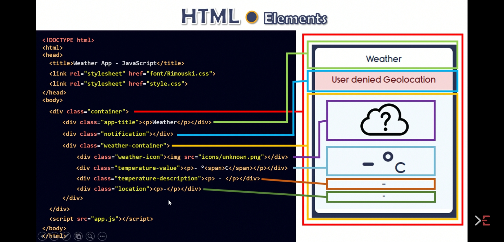

# weather

This comes from an excellent Youtube stream about 'How to create a weather web page with javascript' : https://youtu.be/KqZGuzrY9D4

I have added a automatic reload page each minute.

Automatic geolocation is inhibited so you need to change the coordinates to fit yours in app.js.

#### Capture of the coding process :

